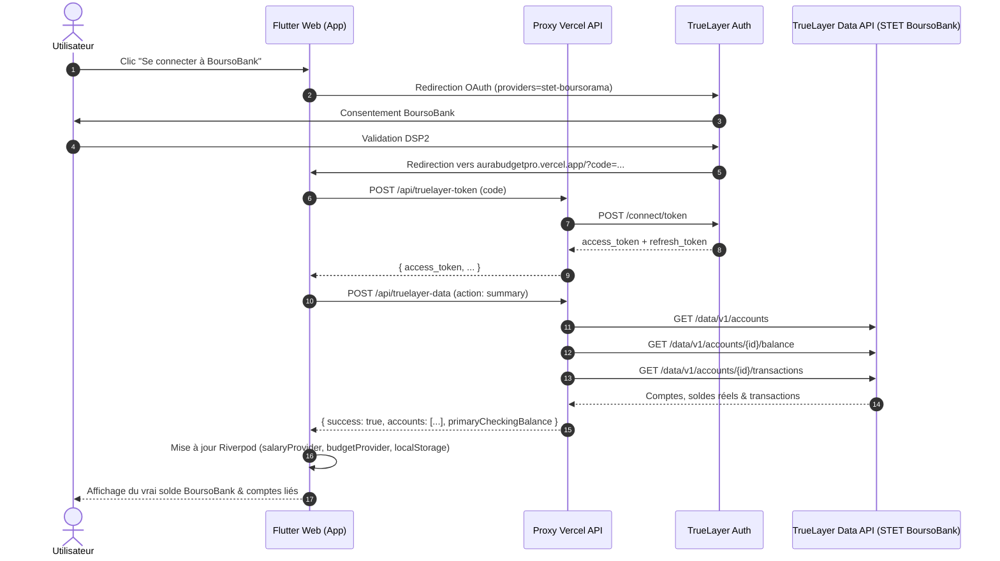

# Post-Mortem & Guide d'Architecture — Intégration TrueLayer BoursoBank Live

Ce document récapitule l'analyse technique des causes racines des anomalies rencontrées lors de la synchronisation bancaire BoursoBank (DSP2 / TrueLayer Live) et les solutions durables implémentées.

---

## 1. Les 3 Causes Racines Identifiées

### Problème 1 : Parsing du body JSON sur les fonctions serverless Vercel Node.js
- **Symptôme initial** : Message vert de succès au token exchange, mais solde à `0.00 €` et perte de session au clic.
- **Cause** : Sur Vercel, `req.body` arrivait sous forme de chaîne `string` JSON brute (sans middleware de body-parser automatique). `req.body.accessToken` valait donc `undefined`, et l'API proxy retournait HTTP 400 (`Missing access token`), vidant la liste des comptes.
- **Solution** : Parsing défensif (`JSON.parse` si type `string`) + repli multi-sources (`req.body`, `req.query`, header `Authorization: Bearer <token>`).

### Problème 2 : Blocage lors de l'interrogation de `/cards` vs `/accounts`
- **Symptôme** : Message `"Token obtenu mais aucun compte BoursoBank n'a pu être synchronisé."`
- **Cause** : Le proxy interrogeait `/accounts` puis échouait brutalement si `/cards` renvoyait 403 (ou inversement), au lieu de fusionner les résultats de manière résiliente.
- **Solution** : Isolation complète des appels `/accounts` et `/cards` avec blocs try/catch dédiés.

### Problème 3 : Typage strict de `transaction_classification` côté client Flutter/Dart
- **Symptôme** : Message `"Connexion autorisée mais aucun compte BoursoBank n'a été renvoyé par TrueLayer."` malgré la réception effective des 3 comptes BoursoBank par le proxy serverless (visible dans les logs Vercel avec `-182 EUR`).
- **Cause** : Dans `settings_provider.dart`, le parsing des transactions faisait `(t['transaction_classification'] as List).first`. Lorsque l'API TrueLayer / STET renvoyait une liste vide `[]` ou une chaîne de caractères, Dart levait une exception (`StateError: No element` ou `TypeError`), capturée par le bloc générique qui renvoyait `false`.
- **Solution** : Parsing défensif de chaque transaction (`is List && isNotEmpty`, `is String`, etc.) sans jamais interrompre la synchronisation des soldes et des comptes.

---

## 2. Architecture Finale

---

## 3. Bonnes pratiques pour les futurs développements

1. **Ne jamais faire de cast brutal en Dart sur des API externes non typées** : Toujours utiliser des vérifications de type `is List`, `is num`, `is Map`.
2. **Ne jamais supposer que `req.body` est déjà parsé dans une serverless function Node.js vanilla** : Toujours vérifier `typeof req.body === 'string'`.
3. **Nettoyer les paramètres URL (`history.replaceState`) immédiatement après lecture du code OAuth** pour éviter les re-exécutions accidentelles sur rafraîchissement F5.
